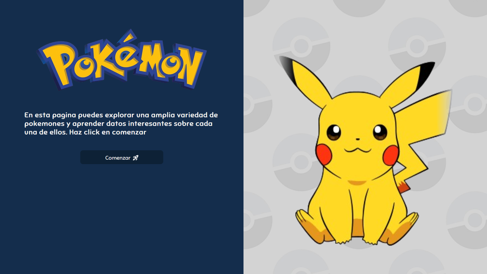
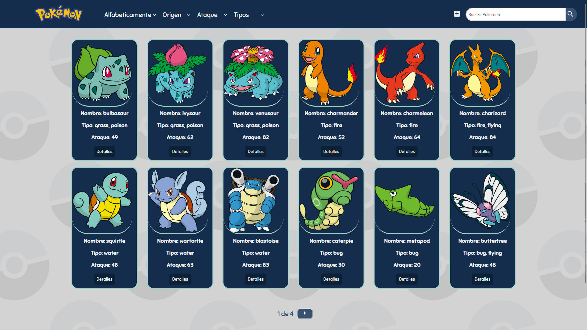
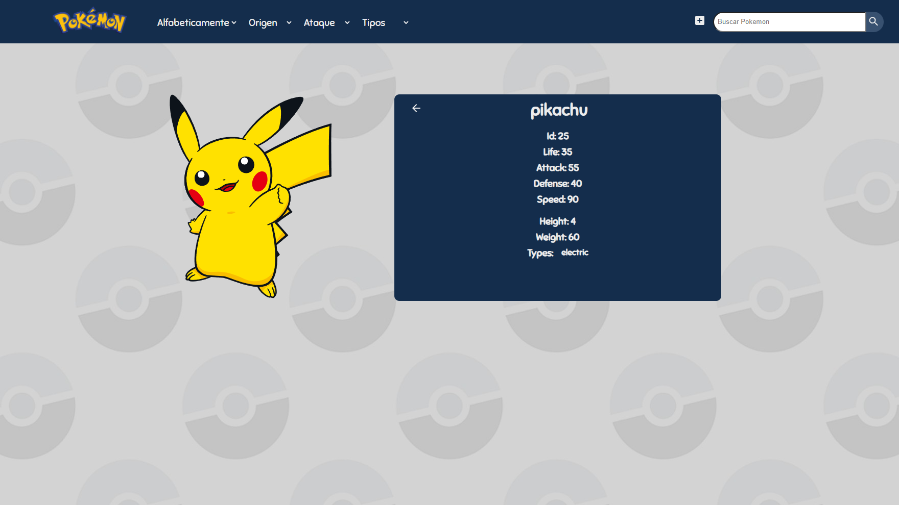
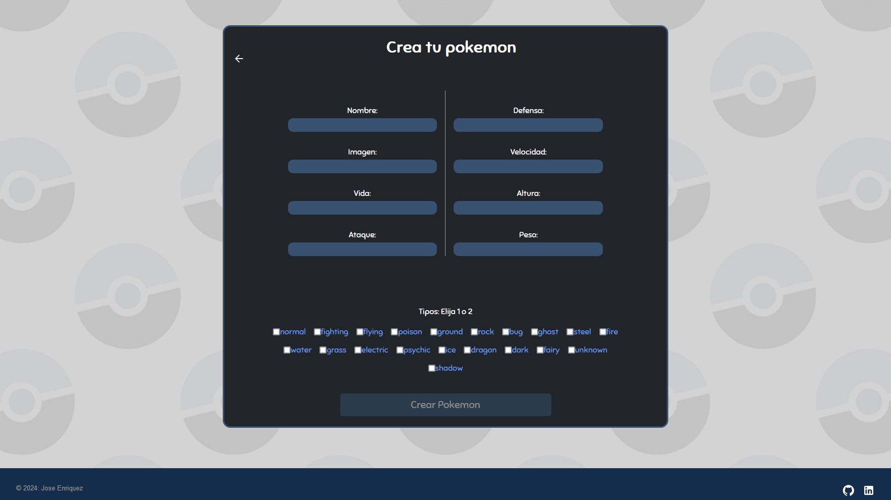

<h1>Poke app</h1>
<h3>Application designed to render and create customized Pokémon, offering the ability to sort them by type, attack, or alphabetically.</h3>
<h3>Additionally, it allows filtering between Pokémon from the API and those added to the user's database.</h3>

<h3>Aplicación diseñada para renderizar y crear pokemones personalizados, ofreciendo la capacidad de ordenarlos por tipo, ataque o alfabéticamente.</h3> 
<h3>Además, permite filtrar entre los pokémon de la API y los añadidos a la base de datos por el usuario.</h3>

<h2>Stack:</h4>
<h3>Frontend: HTML, CSS, Javascript, React, Redux</h3>
<h3>Backend: Node, Express, PostgreSQL</h3>

<h1>Algunas imágenes de la aplicación</h1>

<h1>Some screenshots of the application.</h1>
<h2>Landing</h2>

<h2>Home</h2>

<h2>Pokemon detail/detalle del pokemon</h2>

<h2>Create form/Formulario de creación</h2>

